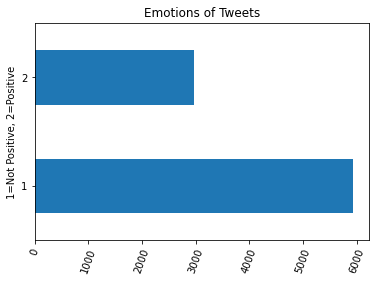

# Tweet_NLP_Project

## Business Understanding
In the rapidly emerging tech industry, launching a new product has become increasingly difficult. New products are emerging every day, and with new launches each day, it becomes easier to have your product become lost in the shuffle. A well-crafted specialized marketing strategy is critical to the successful launch of your tech product, to ensure it receives the proper exposure. If your product isn’t falling in front of the right people, your launch is at risk of being undermined.

One of the most important outcomes of a successful product launch is customer satisfaction. When the product is well received, customer loyalty is built, and positive word-of-mouth naturally creates an elongation of your marketing efforts. It is essential to understand your customer, and how they feel, to provide optimal value to their lives with your product. Understanding customer response to your product allows for continuous improvement in the product lifespan and any additional launches going forward. As machine learning enthusiasts, we understand how to use advanced computational modeling techniques to capture customer response through their words. 

Therefore the purpose of this project is to use natural language processing to perform sentiment analysis using customer social media posts.

## Data
The data is from [data.world](https://data.world/crowdflower/brands-and-product-emotions) and is a collection of tweets surrounding the SXSW (south by southwest festival). The sentiment of approximately 9000 tweets were categorized by human raters as positive, negative, or neither, or unsure. 

Based on our stakholder's ultimate needs to understand positive senitment of tweets, we grouped all non-positive tweets to together to form a non-positive tweets category. Thereby making a binary classification process in the modeling phase. 

## Text Processing
The nature of the text was tweets. These tweets conain mentions (@userhandle), links, hashtags, and the message itself. Tweets call for a variation in syntax based on character limitations. For the text cleaning process we changed all words to lowercase, removed all links, standarized mentions, removed hashtag but kept content of the hashtag, removed punctuation, tokenized the workds, evaluated and removed stopwords for our dataset. The word clouds below represent the words before and after steps parts of the text cleaning process. 

## Modeling
The dataset was iterated through a number of model and vectorizer combinations,the latter being either scikit learn's TfidfVectorizer or CountVectorizer, to determine the final model for the client. Each model was evaluated to prior models and tuned based on the results of the previous model. Models included multinomial naive bayes, complement naive bayes, logistic regression, and decision trees. The results of the models were compared and a final model was selected. 

## Final Model
After tuning the final model the best parameters are C=0.5, max_iter=700, solver='saga'. We evaluated the model by passing through a validation set of data to prove the model performs as well on unseen data as it did during the modeling process. The final model achieved a final accuracy score of 74% and recall score of 87% . 

## Conclusion
We were able to develop a logistic regression model and perform hyperparameter tuning to achieve a final accuracy score of 74% and recall score of 88%. This model uses a supervised learning approach by training on labeled Tweet data, which then assigned sentiment to unseen data more accurately than the unsupervised modeling techniques we explored.  Businesses launching new products can use this model to understand customer sentiment, which is a primary driver in purchasing decision-making. They can use insights gathered from our model to strategically plan for future campaigns.
